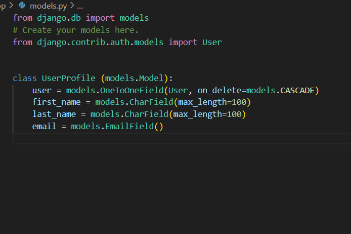
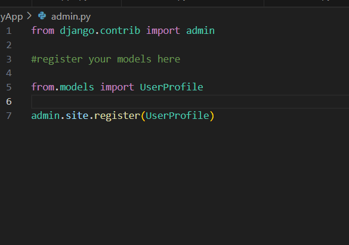

# Ex-04-Django-Models

# NAME:ABDULLAH
# REFERENCE NUMBER:23013613
# Department:AIDS

# AIM:
To create django model

# DESIGN PROCEDURE
Django models

step 1: Create django project and app using the following commands
django-admin startproject mymodels
python manage.py startapp myApp

step 2:
create a user_profile models in model.py

  
add the models in the admin interface using the code admin.py

write the function based view to render the data from the models to the template in views.py

set up the url path for the templates using urls.py

in settings.py file add the appcreated

step 3: Now do the migrations process to initiate and save the models

python manage.py makemigrations 
python manage.py migrate
create a template as user_profile.html

step4:
Run the program using the following command

python manage.py runserver 8000
in the admin page you can view the models created
and in the user_profile template page you can see the profile page of the user
# Output

# Result:
Django model was created successfully
